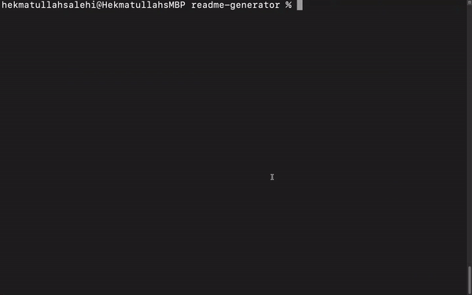

# README generator
## Description
This is a command line application that create a high-quality README file quickly and easily. It helps project creator to devote more time to working on the project. It contains sections entitled Description, Table of Contents, Installation, Usage, License, Tests, and Questions.


## Table of Contents
* [Installation](#Installation)
* [Usage](#Usage)
* [License](#License)
* [Questions](#Questions)
## Installation
Clone the readme-generator repository to your local computer. Run ```npm install``` in the command line or terminal(Mac) to install dependencies. 
## Usage
Open Command line (Windows) or Terminal (Mac). Go to the readme-generator folder then run ```node index.js``` Answers all the prompted questions. When questions finished ```Written successfully``` message appears and the README file is added to the readme-generator folder.


 


[Walkthrough Video](https://drive.google.com/file/d/1S3B8-k4SMppkeeQ-FNlbTv613IrSxRaR/view?usp=sharing) 
## License
This Application is covered under MITLicense

For more information about the License visit [MIT License Page](https://choosealicense.com/licenses/mit/)
## Questions
For further questions please contact me at:

GitHub: [https://github.com/hekmatsalehi](https://github.com/hekmatsalehi)

Email: [hekmatullahsalehi@gmail.com](mailto:hekmatullahsalehi@gmail.com)